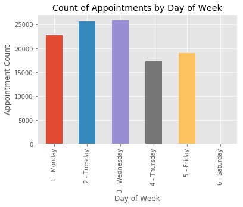
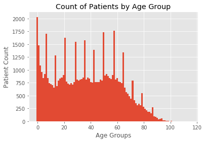
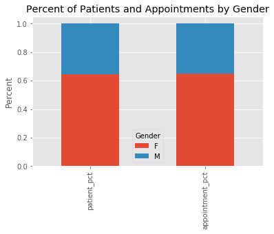
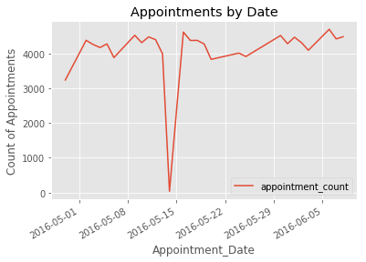

**Springboard Capstone Project 1**

> First capstone project for Springboard Data Science course using patient appointment data to predict no-shows

Based on: https://www.kaggle.com/joniarroba/noshowappointments

---

**Overview**

This repo contains the work for my first capstone project as part of the Springboard [Data Science Career Track](https://www.springboard.com/workshops/data-science-career-track/) curriculum. 

---

**Contents**

- [Project Proposal](#project-proposal)
    - [Problem Statement](#problem-statement)
    - [Potential Clients](#potential-clients)
    - [Data](#data)
- [Methods](#methods)
    - [Inital Investigation](#inital-investigation)
    - [Data Wrangling](#data-wrangling)
- [Results](#results)
    - [Inferential Statistics](#inferential-statistics)
    - [Models](#models)
- [Conclusions](#conclusions)
- [Reference](#reference)

---

# Project Proposal

---

## Problem Statement

Missed appointments are inefficient and costly to both patients and clinicians. Patients often must pay a fee, clinics waste time and effort adjusting their schedule, and other patients miss an opportunity to be seen. Without a method for determining which patients are likely to miss their appointments, clinic staff must spend time contacting all patients with reminders. By identifying those patients most likely to miss an appointment, clinics can take a proactive approach and focus their efforts on reminding and/or rescheduling these patients.

---

## Potential Clients

Physicians, dentists, and other clinicians who schedule outpatient appointments would all benefit from having a method to determine which patients were prone to miss appointments. While patients would certainly benefit from an improved scheduling system, clinics possess the data necessary to predict patient behavior, and would therefore be the intended clients for this project. Clinics could use the methodology developed in this project to predict when a patient is likely to miss an appointment. With this knowledge, they could contact patients in advance of the appointment and identify alternate dates and times. Depending on the results of this analysis, clinics could also predict when appointments are likely to be cancelled due to outside events, such as inclement weather.

---

## Data

I will use a Kaggle [dataset](https://www.kaggle.com/joniarroba/noshowappointments) as the primary dataset for this project. Depending on the completeness and granularity of the data, I may also include data on weather conditions - likely from [NOAA](https://www.ncdc.noaa.gov/data-access).

---

# Methods

---

## Inital Investigation

**Raw Data** *(csv)*

- Fix column names
- Description for each column
- Convert data types as needed
- Recode missing values
- Split/combine columns as needed (ex: Date and Time could be in separate fields)

---

**Clean Data** *(pandas df)*

- Null count per column
- "use" for each column (what its purpose is in the analysis)
- look at unique values (ex: Neighborhoods)

---

**Preliminary Analysis**

- Datetime field investigation
    - overall histogram
    - histogram of appointments per day of week
- Counts for any fields used for categorization/grouping

---

**Notes on Raw Data**

- All fields appear to have no null values.
- PatientId is type float64, but AppointmentID is type int64
- Date(time?) fields: (need to convert)
    - ScheduledDay
    - AppointmentDay

---

- Rename:
    - 'PatientId' --> 'Patient_ID'
    - 'AppointmentID' --> 'Appointment_ID'
    - 'ScheduledDay' --> 'Scheduled_Date'
    - 'AppointmentDay' --> 'Appointment_Date'
    - 'Neighbourhood' --> 'Neighborhood'
    - 'Scholarship' --> 'Welfare' (see note in reference https://en.wikipedia.org/wiki/Bolsa_Fam%C3%ADlia)
    - 'Hipertension' --> 'Hypertension'
    - 'Handcap' --> 'Disability'
    - 'SMS_received' --> 'SMS_sent'
    - 'No-show' --> 'No_show'

---

- Appointment_ID is unique ID
- Age ranges from -1 to 115 (plot this)
- Welfare, Hypertension, Diabetes, Alcoholism, and SMS_sent seem ok
- Disability has a max of 4 (thought this was supposed to be binary...)

---

**Next steps:**

- Plot Age distribution
- Histograms for Date columns
- Unique values/counts for:
    - Gender
    - Neighborhood
    - Disability
    - No_show

---

## Data Wrangling

---

This notebook begins with importing the raw dataset for my capstone project and moves through some basic cleaning and reorganization to produce a pandas DataFrame ready for further analysis. Future exploration will undoubtedly reveal additional data wrangling steps that need to be taken, but for now the dataset produced by this notebook is clean enough that it can be investigated in much more detail than in its raw form. The overall steps taken in this notebook are as follows:

1. Load data into pandas DataFrame
2. Rename columns
3. Convert data types (dates)
4. Set AppointmentID as index
5. Copy to new, clean DataFrame
6. Create Patients and Appointments DataFrames

---

**Counts (Appointments per Patient)**

The records in this dataset represent specific appointments, not just individual patients. There may be redundant data which is really patient level data that is contained in the appointment level dataset. To start investigating this, it will be helpful to get a general sense of how many appointments the average patient has in our dataset.

It looks like the majority of our patients have only 1 appointment, but there are several patients with multiple appointments.

---

**Bar Plot (Appointments per Day of Week)**

Most appointments are clustered in the beginning of the week, with the least coming on Thursday followed by Friday. This may just be representative of the scheduling practices of the clinics, or it could indicate that our dataset ends on a Wednesday.

---

**Histogram (Patients by Age)**

By increasing the number of bins in this histogram, we are seeing age groups of roughly one year. The regular spikes in patient counts indicates that ages in our dataset may have been rounded, and are not entirely accurate.

---

**Comparison (Percent of Patients by Gender vs Percent of Appointments by Gender)**

The ratio of males to females is nearly identical for both patients and appointments, meaning there is no significant difference between the genders in how many appointments they have.

---

**Time Series Plot (Appointments by Date)**

Interestingly, there is a dramatic drop off around June 15th. If this was a holiday, or some other major event, that could have implications for appointments on surrounding dates.

---

# Results

---

## Inferential Statistics

**Means**

The mean patient age is 33.3 years for males and 38.6 years for females.

---

**Pearson Correlation Coefficient**

*Hypertension and Diabetes*

The Pearson Correlation Coefficient between hypertension and diabetes is r = 0.4274

|                     | No Diabetes | Diabetes | Total |
| ------------------: | :---------: | :------: | :---: |
| **No Hypertension** | 0.79        | 0.01     | 0.80  |
| **Hypertension**    | 0.14        | 0.06     | 0.20  |
| **Total**           | 0.93        | 0.07     | 1.00  |

---

*SMS Sent and No-show*

The Pearson Correlation Coefficient between SMS_sent and No_show is r = 0.1264

|              | Show  | No-show | Total |
| -----------: | :---: | :-----: | :---: |
| **No SMS**   | 0.57  | 0.11    | 0.68  |
| **SMS Sent** | 0.23  | 0.09    | 0.32  |
| **Total**    | 0.80  | 0.20    | 1.00  |

---

*Gender and No-show*

The Pearson Correlation Coefficient between Gender and No_show is r = -0.0041

|            | Show  | No-show | Total |
| ---------: | :---: | :-----: | :---: |
| **Female** | 0.52  | 0.13    | 0.65  |
| **Male**   | 0.28  | 0.07    | 0.35  |
| **Total**  | 0.80  | 0.20    | 1.00  |

---

## Models

---

**Setup**

1. Import packages
2. Import datasets (pickle files)
3. Prepare dataset for logistic regression
- Set index to Appointment ID
- Create dummy variables for Day of Week
- Remove columns not needed for model
4. Produce arrays for feature and response variables

---

**Logistic Regression**

1. Create training and test sets
2. Create the classifier: logreg
3. Fit the classifier to the training data
4. Predict the labels of the test set: y_pred
5. Compute and print the confusion matrix and classification report

---

*Confusion Matrix*

| (Actual v) (Predicted >) | No-show | Show  |
| -----------------------: | ------- | ----- |
| **No-show**              | 154     | 8688  |
| **Show**                 | 319     | 35050 |

*Conditions*

| Condition      | Class         | Count |
| -------------- | ------------- | ----- |
| True Negative  | True Show     | 35050 |
| False Positive | False No-show | 319   |
| False Negative | False Show    | 8688  |
| True Positive  | True No-show  | 154   |
    
---

*Classification Report*

|                 | precision | recall | f1-score | support |
| --------------- | --------- | ------ | -------- | ------- |
| **No-show**     | 0.33      | 0.02   | 0.03     | 8842    |
| **Show**        | 0.80      | 0.99   | 0.89     | 35369   |
| **avg / total** | 0.71      | 0.80   | 0.72     | 44211   |

---

**GridSearchCV**

1. Setup hyperparameter grid
2. Instantiate GridSearchCV object
3. Fit data
4. Print tuned parameter and score
5. Compute and print the confusion matrix and classification report

---

*Tuned Logistic Regression Parameters:* {'C': 0.0007196856730011522}

*Best score:* 0.7945141443995416

---

*Confusion Matrix*

| (Actual v) (Predicted >) | No-show | Show  |
| -----------------------: | ------- | ----- |
| **No-show**              | 162     | 8680  |
| **Show**                 | 253     | 35116 |

*Conditions*

| Condition      | Class         | Count |
| -------------- | ------------- | ----- |
| True Negative  | True Show     | 35116 |
| False Positive | False No-show | 253   |
| False Negative | False Show    | 8680  |
| True Positive  | True No-show  | 162   |
    
---

*Classification Report*

|                 | precision | recall | f1-score | support |
| --------------- | --------- | ------ | -------- | ------- |
| **No-show**     | 0.39      | 0.02   | 0.04     | 8842    |
| **Show**        | 0.80      | 0.99   | 0.89     | 35369   |
| **avg / total** | 0.72      | 0.80   | 0.72     | 44211   |

---

# Conclusions

In the overall effort to predict whether or not a patient will miss their scheduled appointment based on the information available in this dataset, the logistic regression model was not successful. After the GridSearch hyperparameter tuning, the logistic regression model correctly classified only 162 of the 8842 no-show appointments in the testing set, while also incorrectly classifying 253 appointments as no-shows which were actually appointments that patients kept.